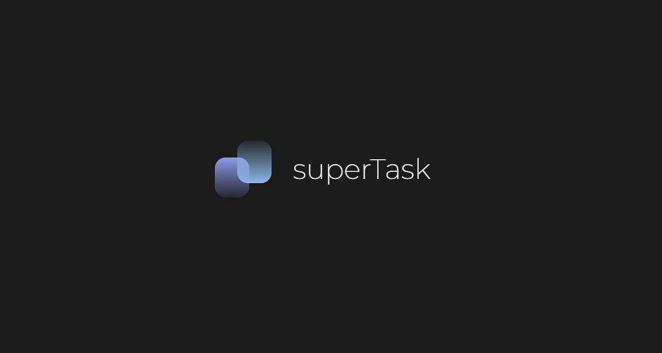

# Super Task 

 

SuperTask é uma plataforma web desenvolvida para te ajudar a organizar tarefas, ideias e anotações de forma clara e objetiva. A ideia é oferecer um espaço onde você possa separar diferentes áreas da sua vida ou projetos em workspaces, definindo prazos e mantendo tudo sob controle.

Essa é a primeira versão (beta) da aplicação, com uma funcionalidade já totalmente funcional: criação e gerenciamento de tarefas dentro de workspaces.

---

## ✨ Funcionalidades no momento:
✅ Usuario pode criar até 5 workspaces

✅ Criação de tarefas com título, descrição e data.

✅ Usuario pode deletar tarefas.

✅ Cadastro e Login criptografados.

✅ Excluir workspace

✅ Tarefas ordenadas com base no prazo

✅ Responsividade mobile

---

## 🔜 Funcionalidades em breve
⏳ Correções de UI

⏳ Status para tarefa (Iniciado, em processo, concluido, etc...)

⏳ Editar tarefa

⏳ Atividades semanais

---

## 🛠️ Stack utilizada

**Front-end:** HTML, CSS, JavaScript  
**Back-end:** Node.js, Express, Sequelize, MySQL  
**Segurança:** JWT, Bcrypt  
**Outros:** dotenv, CORS

Super Task atualmente está em uma hospedagem totalmente gratuita.
 
---

## 🌐 Teste agora mesmo e envie seu feedback
- https://www.mysupertask.shop
- Caso deseja mandar uma sugestão, abra um ISSUE aqui mesmo no repositório do github!
- Ao cadastrar, o aplicativo pedirá um email, mas por enquanto, não precisa ser um email válido.
- Atualizado dia 05/06/2025
